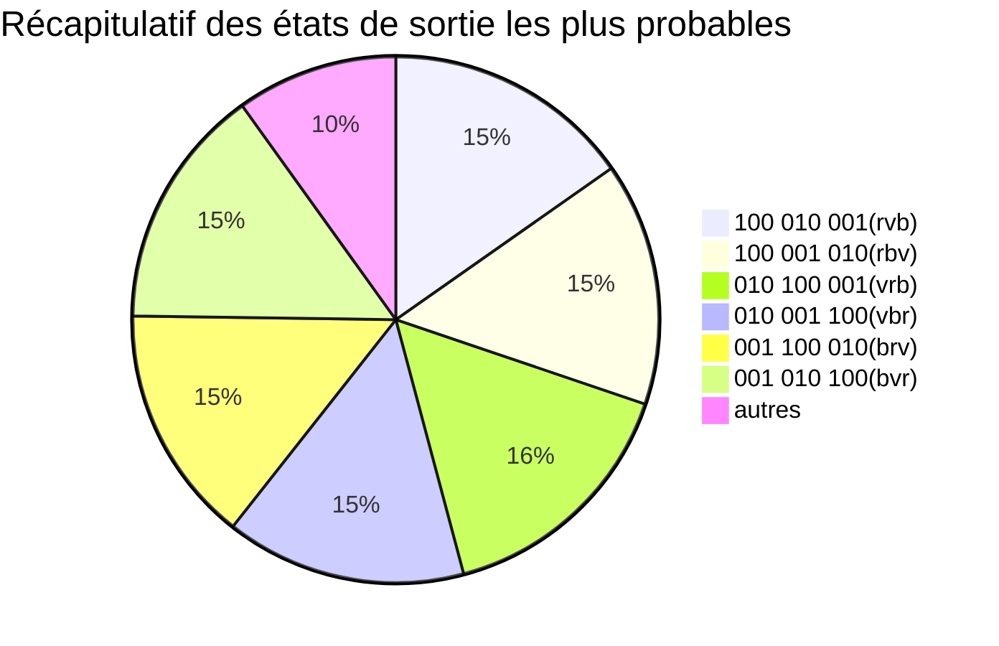

# Découverte de l'informatique quantique

## Les bases de l’informatique quantique

Tout d’abord, il faut envisager l’ordinateur quantique comme une sorte de microprocesseur quantique qui serait « piloté » par un ordinateur classique. C’est donc une entité au fonctionnement un peu particulier qui communique avec l’ordinateur classique. À ce titre, il a ses entrées (issues de l’ordinateur classique) et ses sorties (vers l’ordinateur classique). Exprimé autrement, un ordinateur quantique n’a pas de fonctionnement autonome en tant que tel. Il est en quelque sorte « asservi » et reçoit des requêtes calculatoires depuis l’ordinateur classique. Cette dichotomie apparaît dans la pratique dans la plate-forme Quantum de Microsoft par exemple. Le langage C# est dévolu au pilotage depuis l’ordinateur classique alors que le langage Q# est le langage de programmation de la simulation de l’« ordinateur quantique ».

## Qu'est-ce qu'un Qubit ?

En informatique classique, le bit est le quantum d’information. Un bit classique peut représenter deux états ${Vrai / Faux}$ ou ${0 / 1}$ dans la mémoire de l’ordinateur, ces informations sont représentées soit par un signal électrique soit par une manifestation physique codante (comme un gravage de creux et de bosses sur un disque dur). Pour coder plus d’informations, il nous suffit de grouper plusieurs bits et de leur associer un codage (comme le binaire pour les nombres ou l’ASCII pour les lettres et différents caractères).

En informatique quantique, on utilise des Qubits, un bit quantique ne se limite pas à stocker seulement deux états. Un bit quantique peut être représenté sous la forme d’une combinaison linéaire de deux états quantiques de base $|0\rangle$ et $|1\rangle$ qui représentent les vecteurs :
$$|0\rangle=
\begin{pmatrix}
1\\
0
\end{pmatrix}
etㅤ|1\rangle=
\begin{pmatrix}
0\\
1
\end{pmatrix}
$$
On représente donc mathématiquement un Qubit par la combinaison linéaire suivante de coefficient $α$ et $β$:
$$|Ψ\rangle = 	α|0\rangle+ β|1\rangle = \begin{pmatrix}
α\\
0
\end{pmatrix}+
\begin{pmatrix}
0\\
β
\end{pmatrix} =
\begin{pmatrix}
α\\
β
\end{pmatrix}ㅤα,β\inℂ $$
Afin de représenter plus facilement un Qubit, simplifier les calculs et pouvoir présenter des probabilités, nous devons nous assurer que nos Qubits seront normalisés, à savoir que leur norme est égale à 1 :
$$ |α|²+|β|²=1 $$
A l'inverse d'un bit classique, il n'est pas possible en informatique quantique de connaître la valeur d'un Qubit simplement même si celui-ci existe bien physiquement. Il n'est pas possible de savoir quelles sont les valeurs des coefficients $α$ et $β$ du Qubit. Le seul moyen d'obtenir des informations est d'effectuer une mesure. La mesure a cependant pour effet, l'effondrement immédiat du Qubit, c'est à dire que celui-ci ne sera plus exploitable. 

En informatique quantique, on ne mesure pas un état figé mais seulement un tirage probabiliste dont la probabilité d'occurrence dépend de $α$ et $β$. Ainsi une mesure donnera 0 avec une probabilité de $|α|²$ ou 1 avec une probabilité de $|β|²$. Afin d'être fixé sur les probabilités de chaque tirage, on effetuera un grand nombre d'éxécutions du programme ainsi qu'un grand nombre de mesures.

## Comment représente-t-on un Qubit ?

La sphère de Bloch est une représentation géométrique d'un état pur d'un dispositif quantique à deux niveaux ; c'est par conséquent, entre autre, une représentation d'un qubit. Il est envisageable de généraliser la construction de cette sphère en un dispositif à n niveaux.
La mécanique quantique se formalise dans les espaces de Hilbert, ou plus précisément, dans les espaces de Hilbert projectifs. L'espace projectif des états purs d'un dispositif à 2 niveaux est isomorphe à une sphère.


Pour mieux comprendre, le code python suivant utilise la librairie qutip et permet d'afficher un Qubit en renseignant les coefficients $α$ et $β$, le Qubit sera normalisé avant d'être affiché.
```python=
from qutip.expect import expect
from qutip.operators import sigmax, sigmay, sigmaz
import qutip
import numpy as np
B = qutip.Bloch()
B.make_sphere()
a = 1 + 0j
b = 0 + 0j
x = (a*qutip.basis(2, 0) + b*qutip.basis(2, 1)).unit()
print("Qubit normalisé :")
print('[' + str(x[0][0]))
print(' ' + str(x[1][0]) + ']')
B.add_states(x)
print("Représentation de bloch :"
O = np.arccos(expect(sigmaz(), x))
P = np.NaN if O >= np.pi or O <= 0 else np.arccos(expect(sigmax(), x)/np.sin(O))
print('θ = ' + str((O/np.pi)*180))
print('φ = ' + str((P/(2*np.pi))*360))
B.render()
```


## Qu'est ce qu'une porte quantique ?

Reprenons ici encore notre comparaison avec l'informatique classique pour présenter les fondamentaux. En informatique classique, on exploite des portes de différents types pour faire de la logique, celles-ci peuvent être des portes $OU$ notées $+$ ou $∨$, des portes $ET$ notées $.$ ou $∧$, des portes $non$ notées par une barre survolant l'expression $\bar  {a}$ ou encore une combinaison des portes précédemment citées. L'idée d'une porte logique ou d'un assemblage de portes est de fournir une sortie spécifique à chaque combinaison d'entrée.
Représentation et entrée sortie de la porte $ET$ :


| A   | B   | Sortie |
| --- | --- | ------ |
| 0   | 0   | 0      |
| 0   | 1   | 0      |
| 1   | 0   | 0      |
| 1   | 1   | 1      |

En informatique quantique, les portes ont le même rôle mais elles agissent sur des Qubits et non des bits. Les portes quantiques transforment donc un ou plusieurs Qubits d'entrée en un ou plusieurs Qubits de sortie. 


Les portes quantiques sont généralement représentées par des matrices. Une porte qui agit sur k qubits est représentée par une matrice unitaire ${\displaystyle 2^{k}\times 2^{k}}$. Les nombres de qubits en entrée et en sortie de la porte doivent être égaux. L'action de la porte sur un état quantique spécifique est obtenu en multipliant le vecteur qui représente l'état par la matrice qui représente la porte.

La représentation vectorielle d'un qubit unique est :

$${\displaystyle v_{0}|0\rangle +v_{1}|1\rangle \rightarrow {\begin{pmatrix}v_{0}\\v_{1}\end{pmatrix}}}$$
La représentation vectorielle de deux qubits est :

$${\displaystyle v_{00}|00\rangle +v_{01}|01\rangle +v_{10}|10\rangle +v_{11}|11\rangle \rightarrow {\begin{pmatrix}v_{00}\\v_{01}\\v_{10}\\v_{11}\end{pmatrix}}}$$
Où ${\displaystyle |ab\rangle }$ est à la base du vecteur représentant un état où le premier qubit est dans l'état ${\displaystyle |a\rangle }$ et le second qubit dans l'état ${\displaystyle |b\rangle }$.

## Quelles sont les différentes portes quantiques ?

### Porte de Hadamard:

La porte de Hadamard est une porte très importante en informatique quantique. Elle rend équiprobables les mesures 0 et 1 quand on a les Qubits $|0\rangle$ et $|1\rangle$ en entrée. 

On note cette transformation : 
$$H(|Ψ\rangle) = αH(|0\rangle) + βH(|1\rangle)$$
$$H(|Ψ\rangle) = \frac{α}{\sqrt{2}}(|0\rangle+|1\rangle) + \frac{β}{\sqrt{2}}(|0\rangle-|1\rangle)$$
$$H(|Ψ\rangle) = \frac{α+β}{\sqrt{2}}|0\rangle+ \frac{α-β}{\sqrt{2}}|1\rangle$$
Soit à la forme matricielle : 
$$ H(\begin{pmatrix}
1\\
0
\end{pmatrix}) = \frac{1}{\sqrt{2}} \begin{pmatrix}
1\\
1
\end{pmatrix} ;
H(\begin{pmatrix}
0\\
1
\end{pmatrix}) = \frac{1}{\sqrt{2}} \begin{pmatrix}
1\\
-1
\end{pmatrix} $$
$$ H =
\frac{1}{\sqrt{2}}
\begin{pmatrix}
1 & 1\\
1 & -1
\end{pmatrix}
$$


### Porte Pauli-X

$XNOT$ correspond à la porte logique NOT en informatique classique. En effet, prenant un seul qubit en entrée, elle transforme 1 en 0 et réciproquement. La représentation associée à cette porte quantique est celle de la rotation d’un angle de pi radians (180 degrés) autour de l’axe X du repère XYZ associé à la sphère de Bloch. 

On note cette transformation : 
$$XNOT(|Ψ\rangle) = β|0\rangle+ α|1\rangle$$
Soit à la forme matricielle : 
$$ XNOT =
\begin{pmatrix}
0 & -i\\
i & 0
\end{pmatrix}
$$


### Porte Pauli-Y

La porte Pauli-Y agit sur un seul qubit. Elle transforme ${\displaystyle |0\rangle }$ en ${\displaystyle \mathrm {i} |1\rangle }$ et $|1\rangle$ en ${\displaystyle -\mathrm {i} |0\rangle }$.

Elle équivaut à une rotation autour de l'axe Y de la sphère de Bloch par ${\displaystyle \pi }$  radians.

Elle est représentée par la matrice de Pauli Y : 
$$ Y =
\begin{pmatrix}
0 & 1\\
1 & 0
\end{pmatrix}
$$

### Porte Pauli-Z

La porte Pauli-Z agit sur un seul qubit. Elle laisse l'état de base $|0\rangle$ inchangé et transforme $|1\rangle$ en $-|1\rangle$.

Elle équivaut à une rotation autour de l'axe Z de la sphère de Bloch par $\pi$ radians. C'est donc un cas particulier de la porte Changement de phase (voir ci-dessous) pour ${\displaystyle \phi =\pi }$. De ce fait, elle est parfois appelée phase-flip.

Elle est représentée par la matrice de Pauli Z :
$$ Z =
\begin{pmatrix}
1 & 0\\
0 & -1
\end{pmatrix}
$$

## Peut-on travailler avec plus de Qubits ?

Dans la partie précédente, nous n'avons vu que les portes quantiques qui agissent sur un seul Qubit, il existe en effet d'autres portes quantiques qui ont pour but de faire de la logique et de modifier l'état de plusieurs bits quantiques. Les différentes portes quantiques à plusieurs entrées adoptent une représentation commune. On note par une ligne horizontale les Qubits de travail, on pourra par exemple ajouter un point pour représenter un contrôle ou une croix pour indiquer un échange.

### Porte Swap

La porte Swap intervertit simplement deux Qubits de la manière suivante :


On peut donc passer au format matriciel de la manière suivante : 

$$S(|0.0\rangle) = |0.0\rangle‎ ‎ S(|1.0\rangle) = |0.1\rangle‎ ‎ S(|0.1\rangle) = |1.0\rangle‎ ‎ S(|1.1\rangle) = |1.1\rangle $$

$$S(\begin{pmatrix}1\\0\\0\\0\end{pmatrix})=\begin{pmatrix}1\\0\\0\\0\end{pmatrix}‎ ‎ S(\begin{pmatrix}0\\1\\0\\0\end{pmatrix})=\begin{pmatrix}0\\0\\1\\0\end{pmatrix}‎ ‎ S(\begin{pmatrix}0\\0\\1\\0\end{pmatrix})=\begin{pmatrix}0\\1\\0\\0\end{pmatrix}‎ ‎ S(\begin{pmatrix}0\\0\\0\\1\end{pmatrix})=\begin{pmatrix}0\\0\\0\\1\end{pmatrix}$$

$${\displaystyle {\mbox{SWAP}}=S={\begin{pmatrix}1&0&0&0\\0&0&1&0\\0&1&0&0\\0&0&0&1\end{pmatrix}}}$$

### Racine carrée de la porte Swap

La porte ${\displaystyle {\sqrt {SWAP}}}$ effectue une demi inversion des Qubits. C'est une porte universelle, c'est à dire qu'à l'image du $et/ou$ logique, cette porte permet de créer toutes les autres portes quantiques en la combinant avec des portes à un Qubit.

$${\displaystyle {\sqrt {S}}={\sqrt {\mbox{SWAP}}}={\begin{pmatrix}1&0&0&0\\0&{\frac {1}{2}}(1+\mathrm {i} )&{\frac {1}{2}}(1-\mathrm {i} )&0\\0&{\frac {1}{2}}(1-\mathrm {i} )&{\frac {1}{2}}(1+\mathrm {i} )&0\\0&0&0&1\\\end{pmatrix}}}$$


### Les portes Contrôlées (cX cY cZ)

Les portes contrôlées sont des portes qui s'appuient sur l'état d'un bit quantique pour en faire varier un second. La porte CNOT en est un bon exemple, elle fait varier le second qubit en lui appliquant une porte Pauli-X uniquement si l'état du premier qubit est à $|1\rangle$.

$${\displaystyle {\mbox{CNOT}}=cX={\begin{bmatrix}1&0&0&0\\0&1&0&0\\0&0&0&1\\0&0&1&0\end{bmatrix}}}$$


Les portes cY et cZ appliquent le même principe mais avec les portes Pauli-Y et Pauli-Z.

### Encore plus de portes

La porte de Toffoli est une extension de la porte CNOT citée précédemment, elle prend un qubit de contrôle supplémentaire en entrée. Si les deux premiers qubits sont à $|1\rangle$ alors la porte Pauli-X s'exprime sur le dernier Qubit. 
 
La porte Fredkin est quant à elle une porte SWAP contrôlée sur un troisième Qubit. 

Il existe de nombreuses autres portes avec plus de bits quantiques, mais celles-ci ne sont qu'une composition de portes précédemment citées.

## Quels langages pour l'informatique quantique ?

### Q#
<a href="https://docs.microsoft.com/fr-fr/azure/quantum/overview-what-is-qsharp-and-qdk">Q#</a> est le langage de programmation inventé par Microsoft et dédié à l’informatique quantique. Il peut s’exécuter sur des machines quantiques ou sur des simulateurs quantiques. Il est sorti en 2017 dans sa version 0.1. Il est présenté dans la documentation officielle comme un langage évolutif ( il peut être utilisé sur de très petites machines quantiques de quelques bits quantiques, tout comme sur d’énormes machines qui compteront peut-être un jour des milliers de bits quantiques ) et multiparadigme ( fait de décrire un traitement donné en faisant se succéder des instructions exécutées par la machine ).


### QisKit

<a href="https://qiskit.org/">Qiskit</a> est un kit de développement logiciel (SDK) open-source permettant de travailler avec des ordinateurs quantiques au niveau des circuits, des impulsions et des algorithmes. Il fournit des outils pour créer et manipuler des programmes quantiques et les exécuter sur des dispositifs quantiques prototypes sur l'IBM Quantum Experience ou sur des simulateurs sur un ordinateur local. Il suit le modèle de circuit pour le calcul quantique universel, et peut être utilisé pour tout matériel quantique (il prend actuellement en charge les qubits supraconducteurs et les ions piégés) qui suit ce modèle.

Qiskit a été fondé par IBM Research afin de permettre le développement de logiciels pour leur service d'informatique quantique en nuage, IBM Quantum Experience. Des contributions sont également apportées par des soutiens externes, généralement des institutions universitaires.

La version principale de Qiskit utilise le langage de programmation Python. Des versions pour Swift et JavaScript ont été initialement explorées, bien que le développement de ces versions se soit arrêté. Au lieu de cela, une réimplémentation minimale des fonctionnalités de base est disponible sous le nom de MicroQiskit, qui est conçu pour être facile à porter sur des plateformes alternatives.


### IBM Quantum composer et Quantum Lab


L'<a href="https://quantum-computing.ibm.com/composer/files/new">IBM Quantum Composer</a> et l'<a href="https://quantum-computing.ibm.com/lab">IBM Quantum Lab</a> forment une plateforme en ligne permettant un accès public et premium aux services d'informatique quantique fournis par IBM Quantum. Cela comprend l'accès à un ensemble de processeurs quantiques prototypes d'IBM, un ensemble de tutoriels sur le calcul quantique et l'accès à un manuel interactif. En février 2021, le service comptait plus de 20 appareils, dont six sont librement accessibles au public. Ce service peut être utilisé pour exécuter des algorithmes et des expériences, et explorer des didacticiels et des simulations sur ce qui pourrait être possible avec l'informatique quantique.

Les circuits peuvent être créés soit graphiquement avec le Quantum Composer, soit par programmation dans les carnets Jupyter du Quantum Lab. Les circuits sont créés à l'aide de Qiskit et peuvent être compilés en OpenQASM pour être exécutés sur des systèmes quantiques réels.


### Comment utiliser l'IBM Quantum composer ?

IBM Quantum Composer possède un ensemble d'outils personnalisables qui vous permettent de construire, de visualiser et d'exécuter des circuits quantiques sur des systèmes ou des simulateurs quantiques. Utilisez le menu Plus d'options de chaque fenêtre pour accéder à des outils et actions supplémentaires.


**1 - Panneaux d'outils** - Utilisez le panneau latéral pour afficher vos fichiers ou travaux, ou la documentation. Pour fermer le panneau latéral, cliquez sur l'icône de l'onglet ouvert.

**2 - Barre de menus** - Utilisez ces menus pour ouvrir un nouveau circuit, gérer et inspecter vos circuits enregistrés, personnaliser votre espace de travail, obtenir de l'aide, etc.

**3 - Zone d'exécution** - Modifiez les paramètres d'exécution, puis exécutez votre circuit sur un système quantique ou un simulateur.

**4 - Barre de portes et d'opérations quantiques** - Ce sont les éléments constitutifs des circuits quantiques. Faites glisser et déposez ces portes et d'autres opérations sur l'éditeur de circuit graphique. Les différents types de portes sont regroupés par couleur. Par exemple, les portes classiques sont bleu foncé, les portes de phase sont bleu clair et les opérations non unitaires sont grises.

Pour en savoir plus sur les portes et les <a href="https://quantum-computing.ibm.com/composer/docs/iqx/operations_glossary#q-gates">opérations disponibles</a>, consultez le glossaire des opérations, et pour les voir en action, visitez le <a href="https://quantum-computing.ibm.com/composer/docs/iqx/guide/#user-guide-1">Guide pratique</a>.

**5 - Éditeur de code** - Utilisez le menu Affichage pour ouvrir ou fermer l'éditeur de code, qui vous permet de visualiser et de modifier le code OpenQASM ou Qiskit du circuit.

**6 - Éditeur de circuit graphique** - C'est ici que vous construisez un circuit. Faîtes glisser des portes et d'autres opérations sur les "fils" horizontaux des qubits qui constituent votre registre quantique.

Pour supprimer une porte d'un fil, sélectionnez la porte et cliquez sur le X.

Pour modifier les paramètres et les réglages des portes qui prennent en charge l'édition, sélectionnez la porte dans l'éditeur graphique et cliquez sur Editer (✏️).

**7 - Disques de phase** - La phase du vecteur d'état du qubit dans le plan complexe est donnée par la ligne qui s'étend du centre du diagramme au bord du disque gris (qui tourne dans le sens inverse des aiguilles d'une montre autour du point central).

Utilisez le menu View pour afficher ou masquer les disques de phase.

**8 - Visualisations** - Les visualisations caractérisent votre circuit pendant que vous le construisez. Elles utilisent un simulateur de vecteur d'état à un seul coup, qui est différent du système spécifié dans les paramètres de configuration et d'exécution. Notez que les visualisations ignorent les opérations de mesure que vous ajoutez. Connectez-vous et cliquez sur le bouton Setup and run pour obtenir les résultats du backend spécifié.

Pour en savoir plus sur les visualisations, consultez la section <a href="https://quantum-computing.ibm.com/composer/docs/iqx/visualizations">Visualisations</a>.

**9 - L'interface en action** :


# Application de l'accélération quantique au problème de coloration de graphe

## Le problème de coloration de graphe

Le problème de la coloration de graphe consiste à donner une couleur parmi un ensemble de couleurs données à tous les sommets d'un graphe de telle manière que deux sommets connectés par un arc ne puissent être de la même couleur.

*Exemple d'un graphe coloré avec trois couleurs*

Ce problème est en apparence très simple mais fait en réalité partie de la classe de problème NP-complet, ce qui veut dire qu'il n'existe pas à ce jour d'algorithme polynomial pour sa résolution. Cette complextité nous empêche de résoudre de grandes instances avec plus de deux couleurs à cause du temps de calcul qui en découle.

Même si de nombreuses heuristiques existent pour ce problème (Algorithme de Welsh et Powell, DSATUR), celles-ci rencontrent toujours tôt ou tard leurs limites et finissent par donner une réponse sous optimale en nombre de couleurs. Le seul moyen d'obtenir un résultat optimal est donc d'utiliser le branch and bound par exemple, mais cela peut aboutir à un temps d'exécution insurmontable.

## Apport de l'informatique quantique à la coloration de graphe

Nous allons voir dans cette partie quelles propriétés de l'informatique quantique peuvent nous permettre d'accélérer la recherche de solutions pour le problème de coloration de graphe.
Afin de répondre à cette question, je me suis appuyé sur les formations au langage Q# très qualitatives de Microsoft :

https://docs.microsoft.com/fr-fr/learn/modules/qsharp-explore-key-concepts-quantum-computing/

https://docs.microsoft.com/fr-fr/learn/modules/solve-graph-coloring-problems-grovers-search/

Pour certains problèmes de calcul, l'informatique quantique offre une accélération exponentielle. Cette accélération est possible grâce à trois phénomènes de mécanique quantique : la superposition, l'interférence et l'entrelacement.
Nous présenterons ici rapidement la superposition et l'entrelacement pour expliquer dans les grandes lignes de quoi il s'agit.

### La superposition

La superposition est la capacité non naturelle d'un objet quantique, tel qu'un électron, à exister simultanément dans plusieurs "états" différents. Il se trouve littéralement dans ces différents états simultanément : dans les deux, mais ne les identifie pas. Par la mesure, nous brisons cette superposition et ce n'est qu'alors que nous pouvons dire qu'elle se trouve dans un état ou l'autre.

Il n'est pas possible de mesurer deux attributs liés en même temps, comme la position et la vitesse d'une particule. Il est donc important de savoir exactement ce que l'on mesure, sinon l'état sera perturbé. C'est ce qu'on appelle la rétroaction de mesure : si vous mesurez un état quantique, vous pouvez changer son état de façon permanente.

Comme vu précédemment, il est possible de représenter cette superposition par une combinaison linéaire de deux états.

$$ |ψ⟩=a|ψ_{1}⟩+b|ψ_{2}⟩ $$

Une superposition simple peut être obtenue grâce à la porte de Hadamard $H$.

$$ H|0⟩=\frac{1}{√2}|0⟩+\frac{1}{√2}|1⟩ $$

### L'interférence

Le principe d'interférence est à la base de l'informatique quantique. En effet à chaque qubits peut être associé une fonction d'onde dont l'amplitude de probabilité peut être représentée par des nombres complexes. Les ondes sont régies par une équation linéaire. Cette propriété signifie que les ondes peuvent être superposées les unes aux autres, comme nous l'avons vu précédemment avec les états quantiques. La superposition de différentes ondes permet à leurs amplitudes d'interférer les unes avec les autres et donc d'affecter l'état global de différentes manières.


*Exemple d'interférences destructives*

Il existe deux types d’interférences : 

- Les interférences constructives, c'est lorsque deux ondes ont la même phase, ces deux ondes s'additionnent ce qui amplifie l'amplitude d'onde qui en résulte. Ce phénomène peut être observé dans l'eau lorsque le pic de deux ondes s'additionne.

- Les interférences destructives, c'est quand deux ondes sont déphasées de la moitié de leur période, ce phénomène produit une annulation de l'onde résultante. Ce phénomène est rencontré dans les casques audio qui produisent une onde inverse afin d'éliminer les bruits extérieurs parasites à la musique.

L'interférence entre deux qubits peut être présentée mathématiquement de cette manière : 

$$ |ψ_{1}⟩=\frac{1}{√2}|0⟩+\frac{1}{√2}|1⟩ $$

$$ |ψ_{2}⟩=\frac{1}{√2}|0⟩-\frac{1}{√2}|1⟩ $$

$$ |ψ⟩=\frac{1}{√2}|ψ_{1}⟩ + \frac{1}{√2}|ψ_{2}⟩ = \frac{1}{√2}(\frac{1}{√2}|0⟩+\frac{1}{√2}|1⟩) + \frac{1}{√2}(\frac{1}{√2}|0⟩-\frac{1}{√2}|1⟩) $$

$$ = \frac{1}{2}(|0⟩ + |0⟩) + \frac{1}{2}(|1⟩ - |1⟩) = |0⟩ $$

Les |0⟩ ont subi une interférence constructive tandis que les |1⟩ ont subi une interférence destructive.

### L'oracle quantique

Un oracle quantique est une sorte de boîte noire appliquée comme opération d'entrée d'un autre algorithme. 
Cette focntion boîte noire peut s'écrire de la manière suivante : 
$$ f:\left\{0,1\right\}^{n}→\left\{0,1\right\}^{m} $$

ou

$$ f:\left\{0,1\right\}^{n}→\left\{0,1\right\} $$

dans le cas ou $m = 1$

On cherche par exemple quel ensemble d'entrée va pouvoir nous fournir un $1$ en sortie. De nombreux problèmes peuvent subir une transformation pour être présentés de cette manière, et c'est le cas de la coloration de graphe.

L’oracle doit agir sur les états quantiques plutôt que sur les bits classiques. Il faut coder l'entrée $x$ qui possède la représentation binaire $x=(x_{0},x_{1},...,x_{n−1})$ dans un registre $n$-qubit : $|x⟩=|x_{0}x_{1}...x_{n−1}⟩$

Il existe deux types d'oracles différents, l'oracle à phase et l'oracle à marquage. Il est facile de transformer un oracle à phase en oracle à marquage si l'algorithme le nécéssite.

### L'algorithme de grover

Dans le domaine de l'informatique quantique, l'algorithme de Grover, également connu sous le nom d'algorithme de recherche quantique, désigne un algorithme quantique de recherche non structurée qui permet de trouver avec une forte probabilité l'entrée unique d'une fonction de boîte noire qui produit une valeur de sortie particulière, en utilisant seulement $O({\sqrt {N}})$ évaluations de la fonction, où $N$ est la taille du domaine de la fonction. Elle a été conçue par Lov Grover en 1996.

Commençons par la structure de l'algorithme et expliquons chaque étape en détail.

- Premièrement, il faut obtenir une superposition uniforme de tous les cas de base avec la porte $H$.
En général, il s'agit de la première étape de la plupart des algorithmes quantiques.

- La partie principale de l'algorithme répète une séquence d'étapes. Cette séquence, l'*itération de Grover*, se compose de deux étapes :

    * Exécution de l'*oracle quantique* : 
cette opération effectue une multiplication par −1 des phases de tous les états qui sont solution de notre problème. Notez que cette étape est la seule dans laquelle des informations sur le problème sont utilisées.

    * Application de l'*opérateur de diffusion* : cet opérateur modifie l'amplitude de l'état fondamental. Ainsi, les amplitudes au-dessus de la moyenne deviennent plus petites et les amplitudes au-dessous de la moyenne deviennent plus grandes.

    En général, cette itération *réduit* l'amplitude de l'état fondamental qui n'est pas une solution au problème, *augmente* l'amplitude de l'état fondamental qui est une solution, et maintient les deux types d'amplitudes positives.

- Enfin, l'état du système est mesuré. Plusieurs répétitions montrent que les amplitudes des deux types sont très différentes. Par conséquent, cette mesure donne une forte probabilité de réponse.


### Implémentation

Pour implémenter notre premier programme quantique, nous allons utiliser l’IBM Quantum Composer et l’<a href="https://quantum-computing.ibm.com/lab">IBM Quantum Lab</a> (une interface de programmation cloud par cellule proche de <a href="https://jupyter.org/">Jupyter notebook</a>) qui permettent d'exécuter du code python et la librairie QisKit en ligne dans une page web sans avoir besoin d'installer de logiciels. La plateforme permet d'exécuter du code quantique par simulation ou sur les ordinateurs quantiques physiques d'IBM.

```python=
import pylab
import numpy as np
from qiskit import Aer
from qiskit.utils import QuantumInstance
from qiskit.tools.visualization import plot_histogram
from qiskit.algorithms import Grover, AmplificationProblem
from qiskit.circuit.library.phase_oracle import PhaseOracle
import os
import tempfile
from qiskit.exceptions import MissingOptionalLibraryError
import networkx as nx
import matplotlib.pyplot as plt
```

La première cellule nous permet de réaliser les imports classiques nécéssaires pour ce type de projets.

```python=
graph = { "a" : ["b", "c"],
          "b" : ["c", "a"],
          "c" : ["a", "b"],
        }

graph_converter = {}
for i, j in zip(graph, range(len(graph))):
    graph_converter[i] = str(j + 1)

graph_convert = {}
for i in graph:
    graph_convert[graph_converter[i]] = [graph_converter[j] for j in graph[i]]

graph_convert
```

Cette seconde cellule nous permet d'initialiser un graphe en python. On code ce graphe en utilisant un **dictionnaire**, chaque lettre représente un *sommet* et pointe vers *une liste de sommets* qui lui sont connectés par un *arc*. Dans cette preuve de concept, nous nous concentrerons sur la tricoloration de graphe. Même si il serait facilement possible d'adapter le code pour de la *n-coloration*.
Cette cellule nous permet également de passer d'une numérotation par lettre à une numérotation par chiffre pour la suite : 

```
{'1': ['2', '3'], '2': ['3', '1'], '3': ['1', '2']}
```

Pour la suite, j'ai choisi d'implémenter l'oracle quantique en passant directement par **le problème SAT**, de satisfiabilité booléenne. Cette approche permet d'avoir une meilleure idée de la complexité du problème et de pouvoir comparer rapidement les temps de calcul et réponses quantiques et classiques pour une instance. On pourra éventuellement combiner une résolution quantique et une classique pour obtenir une meilleure complexité. Passer par *des clauses CNF* peut également nous permettre de résoudre tous les autres problèmes que concerne l'algorithme de Grover. Pour rappel,les CNF ou formes normales conjonctives sont une forme normalisée pour les expressions booléennes. Cette forme normalisée impose qu'un ensemble de **ou** logiques soient encadrés par des **et** logiques de la manière suivante : 


```python=
# not (S1C1 and S3C1) = not S1C1 or not S3C1
cnf_1 = []
for i in graph_convert:
    for j in graph_convert[i]:
        for c in range(3):
            cnf_1.append('-S' + str(i) + 'C' + str(c+1) + ' -S' + str(j) + 'C' + str(c+1) + ' 0')
cnf_1[0]
```

Dans cette troisième cellule, nous allons générer **le premier ensemble de clauses**, on indique ici que l'on ne souhaite pas que deux sommets connectés par une arrête aient la même couleur. A cette étape, les clauses sont encore écrites dans une notation compréhensible, elles seront traduites par la suite (- = non logique) :

```
'-S1C1 -S2C1 0'
```

```python=
# S1C1 xor S1C2 xor S1C3 = (not S1C1 or not S1C2 or S1C3) and (not S1C1 or S1C2 or not S1C3) and (S1C1 or not S1C2 or not S1C3) and (S1C1 or S1C2 or S1C3)
cnf_2 = []
for i in graph_convert:
    cnf_2.append('-S' + str(i) + 'C1 -S' + str(i) + 'C2 S' + str(i) + 'C3' + ' 0')
    cnf_2.append('-S' + str(i) + 'C1 S' + str(i) + 'C2 -S' + str(i) + 'C3' + ' 0')
    cnf_2.append('S' + str(i) + 'C1 -S' + str(i) + 'C2 -S' + str(i) + 'C3' + ' 0')
    cnf_2.append('S' + str(i) + 'C1 S' + str(i) + 'C2 S' + str(i) + 'C3' + ' 0')
cnf_2[0]
```

Cette quatrième cellule implémente la génération du **second ensemble de clauses**. Ces clauses forcent chaque nœud à prendre strictement une et une seule couleur : 

```
'-S1C1 -S1C2 S1C3 0'
```

```python=
lenght = len(cnf_1) + len(cnf_2)
cnf_1 = '\n'.join(cnf_1)
cnf_2 = '\n'.join(cnf_2)
cnf = cnf_1 + '\n' + cnf_2
lenght
```

Cette cellule concatène toutes les clauses. On a donc notre ensemble de clauses composé de **cnf_1** et **cnf_2** dans **cnf** sous forme de chaînes de caractères.

```python=
all_ = []

for i in graph_convert:
    for j in range(3):
        all_.append('S'+ str(i) + 'C' + str(j+1))

converter = {}
for i, j in zip(all_, range(len(all_))):
    converter[i] = str(j + 1)
    
for i in converter:
    cnf = cnf.replace(i, converter[i])
```

A cette étape on crée un convertisseur qui recense toutes les variables du problème et les encodent **en un chiffre ou nombre unique**.

```python=
input_sat_instance = '''
c example DIMACS-CNF SAT
p cnf '''

input_sat_instance += str(len(converter)) + ' ' + str(lenght) + '\n' + cnf
print(input_sat_instance)
```

Pour finir, on génère **le format DIMACS-CNF** pour notre problème. Il ne nous reste plus qu'à le résoudre et interpréter le résultat.

```
c example DIMACS-CNF SAT
p cnf 9 30
-1 -4 0
-2 -5 0
-3 -6 0
-1 -7 0
-2 -8 0
-3 -9 0
-4 -7 0
-5 -8 0
-6 -9 0
-4 -1 0
-5 -2 0
-6 -3 0
-7 -1 0
-8 -2 0
-9 -3 0
-7 -4 0
-8 -5 0
-9 -6 0
-1 -2 3 0
-1 2 -3 0
1 -2 -3 0
1 2 3 0
-4 -5 6 0
-4 5 -6 0
4 -5 -6 0
4 5 6 0
-7 -8 9 0
-7 8 -9 0
7 -8 -9 0
7 8 9 0
```

```python=
fp = tempfile.NamedTemporaryFile(mode='w+t', delete=False)
fp.write(input_sat_instance)
file_name = fp.name
fp.close()
oracle = None
try:
    oracle = PhaseOracle.from_dimacs_file(file_name)
except MissingOptionalLibraryError as ex:
    print(ex)
finally:
    os.remove(file_name)
problem = None
if oracle is not None:
    problem = AmplificationProblem(oracle, is_good_state=oracle.evaluate_bitstring)
```

Le code ci-dessus à pour rôle de lire le format DIMACS et de le convertir en **oracle à phase** et en **circuit quantique**. Même si des fonctions sont déjà écrites pour simplifier l'implémentation d'oracle, il est possible de le faire manuellement sur l'IBM Quantum Lab grâce à Qiskit. Notamment, il est possible de s'entraîner et de mieux comprendre comment ces fonctions de haut niveau fonctionnent grâce aux fichiers présents à l'initialisation de votre espace IBM Quantum Lab :
- Lab files/qiskit-tutorials/qiskit/algorithms/06_grover.ipynb
- Lab files/qiskit-tutorials/qiskit/algorithms/07_grover_examples.ipynb

```python=
backend = Aer.get_backend('aer_simulator')
quantum_instance = QuantumInstance(backend, shots=4096)
grover = Grover(quantum_instance=quantum_instance)
result = None
if problem is not None:
    result = grover.amplify(problem)
    print(result.assignment)
```

Cette nouvelle cellule présente le code pour effectuer la résolution du problème **grâce au simulateur** 'aer_simulator'. J'ai pu également réaliser des tests **sur un véritable ordinateur quantique** grâce à ma clé d'API. En utilisant ce type de fonction de haut niveau, il n'est plus nécessaire de définir le nombre optimal d'itération qui est estimé automatiquement, idem pour le nombre de Qubits. Pour rappel, si notre problème comporte $N$ attributions de variables possibles, dont $M$ constituent des solutions au problème, le nombre optimal d’itérations est le suivant :

$$R_{opt}≈\frac{π}{4}\sqrt{\frac{N}{M}}$$

Il est cependant toutefois nécéssaire de définir un nombre d'exécutions *shots=4096*, pour vérifier quelle est la sortie avec la plus haute probabilitée d'occurence. Il est ainsi possible d'obtenir le diagramme des occurences pour chaques possibilités de sortie. Ce diagramme n'est ici pas des plus lisible car il contient $2^{9} = 512$ combinaisons possibles.



La réponce du simulateur pour cet exemple n'est autre que la combinaison sortie le plus de fois : 

```
010100001
```

```python=
G = nx.Graph(graph)
pos = nx.spring_layout(G)

sortie = [str(result.assignment)[i*3: i*3+3] for i in range(int(len(str(result.assignment))/3))]

color = ['red', 'green', 'blue']
color_map = [None for i in graph]
for i, j in zip(sortie, range(len(sortie))):
    if i == '100':
        color_map[j] = color[0]
    if i == '010':
        color_map[j] = color[1]
    if i == '001':
        color_map[j] = color[2]

print(color_map)

nx.draw(G, pos, node_color=color_map, with_labels=True)
plt.show()

```

Cette dernière cellule à pour rôle de convertir le résultat en un rendu plus lisible, d'abord en couleur puis en graphe grâce à la librairie networkx :

```
['green', 'red', 'blue']
```


Voici donc notre première coloration de graphe quantique.
